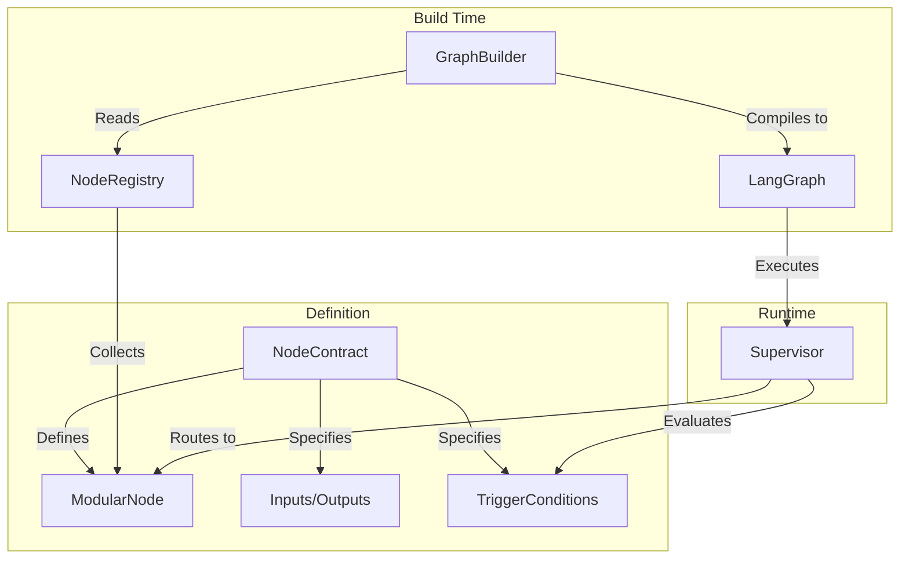

# agent-contracts

[](https://pypi.org/project/agent-contracts/)
[](https://pypi.org/project/agent-contracts/)
[](https://www.python.org/downloads/)
[](https://opensource.org/licenses/MPL-2.0)
[](https://github.com/yatarousan0227/agent-contracts/actions/workflows/ci.yml)

[](https://yatarousan0227.github.io/agent-contracts/)
[](https://discord.gg/Pt6zShBC)

[English](README.md) | 日本語

📘 **Full Documentation**: [https://yatarousan0227.github.io/agent-contracts/](https://yatarousan0227.github.io/agent-contracts/)

🧩 **公式Skills（エージェント指示ファイル）**: `docs/skills/official/index.md`

**ドキュメント**
- **Getting Started（入門ガイド）**: [docs/getting_started.ja.md](docs/getting_started.ja.md)
- **API Reference**: [https://yatarousan0227.github.io/agent-contracts/](https://yatarousan0227.github.io/agent-contracts/)

**LangGraphエージェントを構築するための、モジュール式・契約駆動型ノードアーキテクチャ。**

## ▶️ 対話デモを試す

コントラクト駆動のルーティングと意思決定トレースを体験するには、対話型テックサポートデモを起動してください：

デモガイド: [examples/interactive_tech_support/README.md](examples/interactive_tech_support/README.md)

```bash
python -m examples.interactive_tech_support
```

## プロジェクトステータス

本プロジェクトは現在 **Beta**（`Development Status :: 4 - Beta`）です。公開APIおよび `agent-contracts` CLI は 1.0 に向けて安定化を進めており、破壊的変更がある場合は CHANGELOG に移行手順とともに明記します。

---

### The Problem (課題)
LangGraphを使ったマルチエージェントシステムの構築は強力ですが、規模が大きくなると管理が難しくなります。ノードが増えるにつれて、手動での配線（`graph.add_edge`）は複雑化し、ルーティングロジックは条件付きエッジの中に分散し、データの流れを追うことが不可能になります。

### Why agent-contracts? (なぜ必要なのか)
メンテナンス可能なエージェントシステムを構築するには、**ノードの振る舞い**（何をするか）と**グラフの構造**（どう繋がるか）を分離する必要があります。LLMによる柔軟なルーティングを犠牲にすることなく、厳密なインターフェース定義が必要です。

### The Solution (解決策)
`agent-contracts` は LangGraph に **Contract-Driven Development（契約駆動開発）** を持ち込みます。
エッジを手動で配線するのではなく、各エージェントに対して `NodeContract`（入力、出力、実行条件）を定義します。フレームワークはこれらの契約（Contract）を**自動的にコンパイル**し、複雑なルーティング、型チェック、状態管理を処理する完全な機能を持つLangGraphを構築します。


---

## 🎯 Target Audience (想定読者)

このライブラリは以下の方向けです：
- **複雑なマルチエージェントシステムを構築する開発者**：構造と保守性を必要とする場合。
- **チーム開発**：メンバーが異なるエージェントモジュールを分担して開発する場合。
- **プロダクションアプリケーション**：厳密なインターフェース定義（I/O）と型安全性を必要とする場合。

*対象外：LangChain/LangGraphの基本機能だけで十分な、単純な線形チャットボットやシングルエージェントのプロトタイプ。*

---

## 💡 Use Cases (ユースケース)

- **複雑なルーティングロジック**: ルール（例：「変数Xがセットされている場合」）とLLMの判断（例：「ユーザーが購入を意図している場合」）が混在する、数十のエージェントを持つシステムを管理する。
- **モジュール化されたエージェント開発**: エージェントのロジックを分離します。開発者はグラフ全体の構造を知らなくても、契約（Contract）だけを定義して「検索エージェント」を実装できます。
- **ハイブリッド・スーパーバイザー**: 明確なビジネスルールを優先し、曖昧なケースではLLMにフォールバックするスーパーバイザーを、手間なく実装できます。

---

## 🆚 Comparison (比較)

| 機能 | Vanilla LangGraph | agent-contracts |
|---------|-------------------|-----------------|
| **配線 (Wiring)** | 手動 `add_edge` & `add_conditional_edges` | Contractに基づく **完全自動** |
| **ルーティング** | 条件付き関数内の独自ロジック | 宣言的な `TriggerConditions` (ルール + LLM) |
| **状態アクセス** | 安全でない辞書アクセス (`state["key"]`) | **型安全** な `StateAccessor` パターン |
| **スケーラビリティ** | グラフが大きくなると保守困難 | **モジュール式**、ノードは自己完結 |
| **可観測性** | 標準的なトレーシング | **拡張版**、なぜそのノードが選ばれたかを追跡 |

---

## 🏗️ Architecture (アーキテクチャ)



1. **Define**: **Contract** (I/O と Trigger) を持つノードを作成します。
2. **Register**: ノードを **Registry** に登録します。
3. **Build**: **GraphBuilder** がレジストリを読み込み、実行可能な LangGraph にコンパイルします。
4. **Run**: **Supervisor** が契約に基づいてトラフィックを動的にルーティングします。

### スマートなコンテキスト構築

Supervisor は以下の方法で LLM コンテキストを構築します:
- **基本スライス**: 常に `request`, `response`, `_internal` を含む
- **カスタマイズ可能**: アプリケーション固有のコンテキストにカスタム `context_builder` をサポート
- **フィールドサニタイズ**: 長いフィールドや画像データを自動的にサニタイズ

---

## 🚀 Quick Start

### 1. Hello World (最小構成)

値を返すだけのシンプルなノードを定義します。

```python
import asyncio

from agent_contracts import (
    BaseAgentState,
    ModularNode,
    NodeContract,
    NodeInputs,
    NodeOutputs,
    TriggerCondition,
)
from agent_contracts import get_node_registry, build_graph_from_registry

# 1. ノードの定義
class HelloNode(ModularNode):
    CONTRACT = NodeContract(
        name="hello",
        description="Helloメッセージを返す",
        reads=["request"],
        writes=["response"],
        supervisor="main",
        trigger_conditions=[TriggerCondition(priority=100)],  # 常に最優先でトリガー
        is_terminal=True,  # このノードの後にフローを終了
    )

    async def execute(self, inputs: NodeInputs, config=None) -> NodeOutputs:
        return NodeOutputs(
            response={
                "response_type": "done",
                "response_message": "Hello World!",
            }
        )

async def main() -> None:
    # 2. 登録とビルド
    registry = get_node_registry()
    registry.register(HelloNode)

    graph = build_graph_from_registry(
        registry=registry,
        supervisors=["main"],
        state_class=BaseAgentState,
    )
    graph.set_entry_point("main_supervisor")  # LangGraphのコンパイルに必要
    compiled = graph.compile()

# 3. 実行
    result = await compiled.ainvoke({"request": {"action": "start"}})
    print(result["response"])

if __name__ == "__main__":
    asyncio.run(main())
```

### 2. Practical Example (ルーティング)

ルールベースのトリガーとLLMベースのトリガーを組み合わせた、より実践的な構成です。

```python
from agent_contracts import ModularNode, NodeContract, TriggerCondition

# Node A: ユーザーが「天気」について尋ねた場合に実行 (LLMによる意味的一致)
class WeatherNode(ModularNode):
    CONTRACT = NodeContract(
        name="weather_agent",
        description="天気関連のリクエストを処理",
        reads=["request"],
        writes=["response"],
        supervisor="main",
        requires_llm=True,
        trigger_conditions=[
            TriggerCondition(
                llm_hint="User is asking about the weather forecast",
                priority=10
            )
        ]
    )
    # ... 実装 ...

# Node B: 特定のフラグがある場合に実行 (ルール一致)
class UrgentNode(ModularNode):
    CONTRACT = NodeContract(
        name="urgent_agent",
        description="緊急/高優先度リクエストを処理",
        reads=["request"],
        writes=["response"],
        supervisor="main",
        trigger_conditions=[
            TriggerCondition(
                when={"request.priority": "high"},
                priority=20  # LLMより先にチェックされる
            )
        ]
    )
    # ... 実装 ...
```

---

## 🧰 CLI

登録済みノードから、コントラクトの検証/可視化/差分を実行できます：

```bash
agent-contracts validate --module myapp.nodes --strict
agent-contracts visualize --module myapp.nodes --output ARCHITECTURE.md
agent-contracts diff --from-module myapp.v1.nodes --to-module myapp.v2.nodes
```

詳細は `docs/cli.ja.md` を参照してください。

## 📦 Examples

- `examples/05_backend_runtime.py`: Strict検証付きのバックエンド実行例
- `examples/03_simple_chatbot.py`: 最小構成のルールベースルーティング
- `examples/04_multi_step_workflow.py`: 逐次ワークフロー例
- [`examples/interactive_tech_support/`](examples/interactive_tech_support/): 対話型のマルチノードデモ（ルーティングトレース + 任意のLLM）。実行: `python -m examples.interactive_tech_support`

---

## ✨ Key Features

- **📝 Contract-Driven Design**: `NodeContract` を通じて、入力/出力、依存関係、トリガー条件を宣言します。
- **🔧 Registry-Based Architecture**: 手動配線なしで、登録されたノードから LangGraph を自動構築します。
- **🧠 LLM-Driven Supervisor**: 決定論的なルールと LLM の推論を組み合わせたインテリジェントなルーティング。
- **📊 Typed State Management**: 厳密なバリデーションを持つ Pydantic ベースの状態スライス。
- **🔒 StateAccessor**: IDEの自動補完が効く、型安全でイミュータブルな状態アクセス。
- **🔄 Unified Runtime**: フック、セッション管理、ストリーミング (SSE) をサポートする実行エンジン。
- **⚙️ Configuration**: Pydantic バリデーション付きの YAML で設定を外部化。

---

## 🏗️ Core Concepts

### NodeContract
契約（Contract）はノードの「正像」です。

```python
NodeContract(
    name="my_node",
    description="Calculates mortgage payments",
    reads=["user_profile", "loan_data"],
    writes=["payment_schedule"],
    requires_llm=True,                 # LLMが必要かどうか
    supervisor="main",                 # このノードを管理するスーパーバイザー
    trigger_conditions=[
        TriggerCondition(llm_hint="User asks about monthly payments")
    ]
)
```

### GenericSupervisor
スーパーバイザーが制御フローを処理します：
1.  **Strict Rules**: 高優先度の `when` 条件をチェックします。
2.  **LLM Decision**: マッチするルールがない場合、`llm_hint` を使って LLM に問い合わせます。
3.  **Fallback**: 決定できない場合のデフォルトの振る舞い。

### InteractiveNode
対話型エージェントの作成には、`InteractiveNode` を継承します。これは、ターンの制御、質問の生成、回答の処理を行うための構造化された方法を提供します。

```python
from agent_contracts import InteractiveNode

class InterviewNode(InteractiveNode):
    CONTRACT = NodeContract(
        name="interview",
        description="会話型ワークフローノード",
        reads=["request", "_internal"],
        writes=["response", "_internal"],
        supervisor="main",
        trigger_conditions=[
            TriggerCondition(priority=10, llm_hint="会話型ワークフローに使用"),
        ],
    )
    
    def prepare_context(self, inputs):
        """入力からコンテキストを抽出"""
        return {"interview_state": inputs.get_slice("interview")}
    
    def check_completion(self, context, inputs):
        """インタビューが完了したかチェック"""
        return context["interview_state"].get("complete", False)
    
    async def process_answer(self, context, inputs):
        """ユーザーの回答を処理"""
        # 回答処理ロジック
        return True
    
    async def generate_question(self, context, inputs):
        """次の質問を生成"""
        return NodeOutputs(
            response={
                "response_type": "question",
                "response_data": {"question": "..."},
            }
        )
```

### State Accessor
文字列による安全でない状態アクセスを回避します。`StateAccessor` は状態スライスへの型安全な読み書きを提供します。

```python
from agent_contracts import Internal, reset_response

# Bad
user_id = state["profile"]["id"]

# Good (agent-contracts)
user_id = Internal.user_id.get(state)

# 書き込み (新しい状態を返す)
state = Internal.turn_count.set(state, 5)
state = reset_response(state)
```

---

## 🎨 高度な機能: カスタムコンテキストビルダー

デフォルトでは、`GenericSupervisor`はルーティング判断のためにLLMに`request`、`response`、`_internal`スライスのみを渡します。追加のコンテキスト（例：会話履歴、ドメイン状態）が必要な複雑なシナリオでは、カスタム`context_builder`を提供できます。

#### フィールド長のサニタイズ (v0.3.3+)

Supervisorは、大きなバイナリデータ（例：base64画像）がLLMプロンプトに含まれるのを防ぐため、長いフィールド値を自動的にサニタイズします：

```python
supervisor = GenericSupervisor(
    supervisor_name="shopping",
    llm=llm,
    max_field_length=10000  # デフォルト: 10000文字
)
```

- 画像データパターン（`image`、`iVBOR`、`/9j/`、`R0lGOD`、`image`）は`[IMAGE_DATA]`に置換
- 長いテキストフィールドは最初の`max_field_length`文字を保持し、`...[TRUNCATED:{n}_chars]`を追加
- この最適化により、ルーティング精度を維持しながらトークン消費を削減

### 例: ECサイトエージェント

```python
from agent_contracts import GenericSupervisor

def ecommerce_context_builder(state: dict, candidates: list[str]) -> dict:
    """ECサイトのルーティング判断用のコンテキストを構築"""
    cart = state.get("cart", {})
    inventory = state.get("inventory", {})
    
    return {
        "slices": {"request", "response", "_internal", "cart", "inventory"},
        "summary": {
            "cart_total": sum(item["price"] for item in cart.get("items", [])),
            "low_stock_count": len([i for i in inventory.get("items", [])
                                     if i["quantity"] < 10]),
            "user_tier": state.get("user", {}).get("tier", "standard"),
        },
    }

supervisor = GenericSupervisor(
    supervisor_name="checkout",
    llm=llm,
    registry=registry,
    context_builder=ecommerce_context_builder,
)
```

### 例: 会話認識エージェント

```python
def conversation_context_builder(state: dict, candidates: list[str]) -> dict:
    """会話履歴を含むコンテキストを構築"""
    messages = state.get("conversation", {}).get("messages", [])
    user_messages = [m for m in messages if m.get("role") == "user"]
    
    return {
        "slices": {"request", "response", "_internal", "conversation"},
        "summary": {
            "total_turns": len(user_messages),
            "last_question": messages[-2].get("content") if len(messages) >= 2 else None,
            "last_answer": messages[-1].get("content") if messages else None,
        },
    }

supervisor = GenericSupervisor(
    supervisor_name="assistant",
    llm=llm,
    context_builder=conversation_context_builder,
)
```

### ユースケース

- **会話認識ルーティング**: コンテキストに応じた判断のためにチャット履歴を含める
- **ビジネスロジック統合**: 在庫、価格、ユーザーティアなどを組み込む
- **マルチモーダルエージェント**: 画像分析、音声トランスクリプトなどを追加
- **ドメイン固有ルーティング**: アプリケーションに合わせたスーパーバイザーの動作をカスタマイズ

### APIリファレンス

詳細は[APIドキュメント](https://yatarousan0227.github.io/agent-contracts/)の`ContextBuilder`プロトコルを参照してください。

---

## 🔄 Runtime Layer

プロダクションアプリケーションでは、統一された実行、ライフサイクルフック、ストリーミングのためにRuntime Layerを使用します。

### AgentRuntime
標準的なリクエスト/レスポンス実行。

```python
from agent_contracts import AgentRuntime, RequestContext, InMemorySessionStore

runtime = AgentRuntime(
    graph=compiled_graph,
    session_store=InMemorySessionStore(),
)

result = await runtime.execute(RequestContext(
    session_id="abc123",
    action="answer",
    message="I like casual style",
    resume_session=True, # ストアから状態をロード
))

print(result.response_type)  # "interview", "proposals", etc.
print(result.response_data)  # レスポンスペイロード
```

### StreamingRuntime (SSE)
SSE (Server-Sent Events) ストリーミングをサポートし、各ノードの実行時にイベントを送信します。

```python
from agent_contracts.runtime import StreamingRuntime

runtime = (
    StreamingRuntime()
    .add_node("search", search_node, "Searching...")
    .add_node("stylist", stylist_node, "Generating recommendations...")
)

async for event in runtime.stream(request):
    yield event.to_sse()
```

### Custom Hooks & Session Store
振る舞いをカスタマイズするためにプロトコルを実装します。

```python
from agent_contracts import RuntimeHooks, SessionStore

class MyHooks(RuntimeHooks):
    async def prepare_state(self, state, request):
        # 実行前に状態を正規化またはエンリッチ
        return state
    
    async def after_execution(self, state, result):
        # セッションの永続化やログ出力など
        pass
```

---

## 📦 Installation

```bash
pip install agent-contracts

# gitからインストールする場合
pip install git+https://github.com/yatarousan0227/agent-contracts.git
```

### Requirements
- Python 3.11+
- LangGraph >= 0.2.0
- LangChain Core >= 0.3.0
- Pydantic >= 2.0.0

---

## ⚙️ Configuration

コードを変更することなくエージェントの振る舞いを管理できます。

```yaml
# agent_config.yaml
supervisor:
    max_iterations: 10
io:
    # コントラクトI/O制約（実行時）
    strict: false                 # true: ContractViolationError で停止
    warn: true                    # 違反時に警告ログ
    drop_undeclared_writes: true  # コントラクト外writeはデフォルトで破棄

response_types:
    terminal_states: ["done", "error"]

features: {}
```

```python
from agent_contracts.config import load_config
config = load_config("agent_config.yaml")
```

---

## 🔍 Observability (LangSmith)

`agent-contracts` は [LangSmith](https://smith.langchain.com/) と完全に統合されており、深いトレーシングが可能です。

- **推論の可視化**: なぜ Node B ではなく Node A が選ばれたのか？
- **使用状況の追跡**: ループは何回回ったか？

LangChain の API キーを設定する必要があります：

```bash
export LANGCHAIN_TRACING_V2=true
export LANGCHAIN_API_KEY="..."
```

---

## 🏗️ Architecture Visualization

コードからプロフェッショナルなドキュメントを生成します。

```python
from agent_contracts import ContractVisualizer
visualizer = ContractVisualizer(registry, graph=compiled)
doc = visualizer.generate_architecture_doc()
```

### 生成されるセクション

| セクション | 説明 |
|---------|-------------|
| **📦 State Slices** | 読み手/書き手を含む全スライス + ER図 |
| **🔗 LangGraph Node Flow** | コンパイルされたLangGraphのMermaid可視化 |
| **🎯 System Hierarchy** | スーパーバイザー-ノード構造のMermaidフローチャート |
| **🔀 Data Flow** | 共有スライスを通じたノード依存関係 |
| **⚡ Trigger Hierarchy** | 優先度順のトリガー (🔴 高 → 🟢 低) |
| **📚 Nodes Reference** | 全ノードの詳細テーブル |

各セクションを個別に生成することも可能です：

```python
print(visualizer.generate_langgraph_flow())
print(visualizer.generate_state_slices_section())
```

出力例は [ARCHITECTURE_SAMPLE.md](docs/ARCHITECTURE_SAMPLE.md) を参照してください。

---

## 📚 API Reference

### Main Exports

| Export | Description |
|--------|-------------|
| `ModularNode` | すべてのエージェントの基底クラス。 |
| `InteractiveNode` | 対話型エージェントの基底クラス。 |
| `NodeContract` | ノードI/O契約（Contract）定義。 |
| `TriggerCondition` | ルーティングのためのトリガー条件。 |
| `NodeInputs` / `NodeOutputs` | 型付きI/Oコンテナ。 |
| `NodeRegistry` | ノードの登録と検出。 |
| `GenericSupervisor` | LLM駆動のルーティングスーパーバイザー。 |
| `GraphBuilder` | LangGraph自動構築ビルダー。 |
| `BaseAgentState` | スライスを持つ基底状態クラス。 |
| `ContractVisualizer` | アーキテクチャドキュメント生成ツール。 |

### Runtime Layer

| Export | Description |
|--------|-------------|
| `AgentRuntime` | ライフサイクルフックを持つ統合実行エンジン。 |
| `StreamingRuntime` | SSEのためのノードごとのストリーミング。 |
| `RequestContext` | 実行リクエストコンテナ。 |
| `ExecutionResult` | レスポンスを含む実行結果。 |
| `RuntimeHooks` | カスタマイズフック用プロトコル。 |
| `SessionStore` | セッション永続化用プロトコル。 |

---

## 🤝 Contributing

貢献は大歓迎です！プルリクエストを送ってください。

---

## 📄 License

このプロジェクトは Mozilla Public License 2.0 (MPL-2.0) の下でライセンスされています。詳細は [LICENSE](LICENSE) ファイルをご覧ください。

---

## 🔗 Links

- [GitHub Repository](https://github.com/yatarousan0227/agent-contracts)
- [LangGraph Documentation](https://langchain-ai.github.io/langgraph/)
